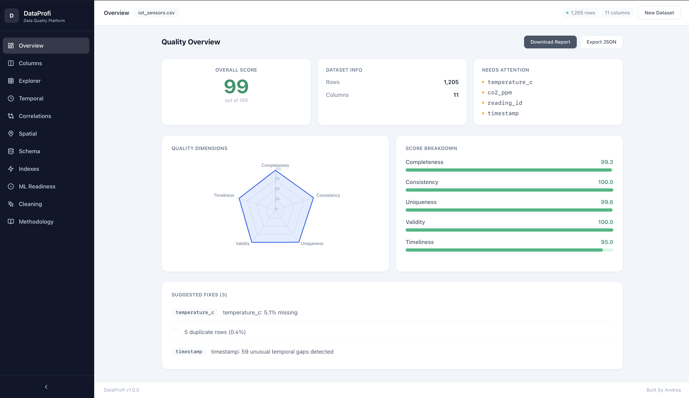
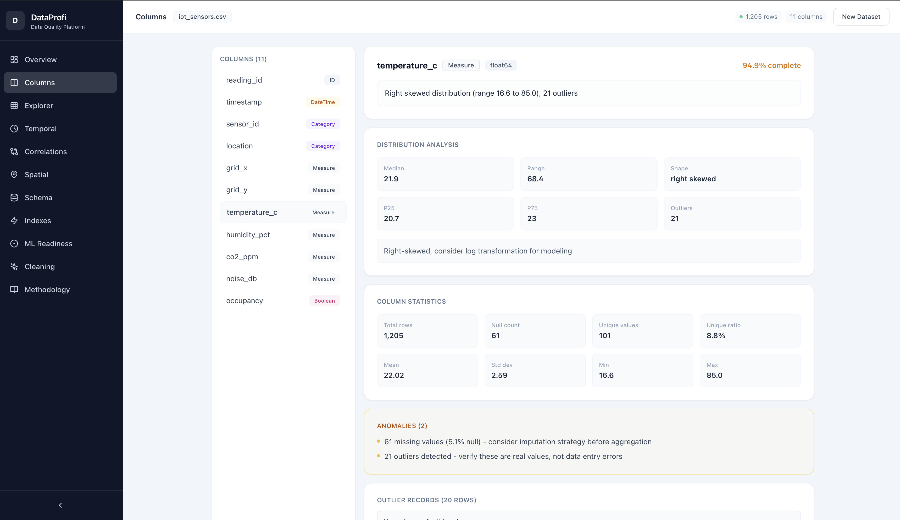
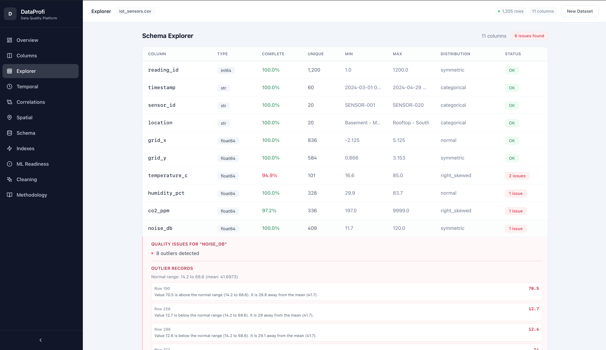
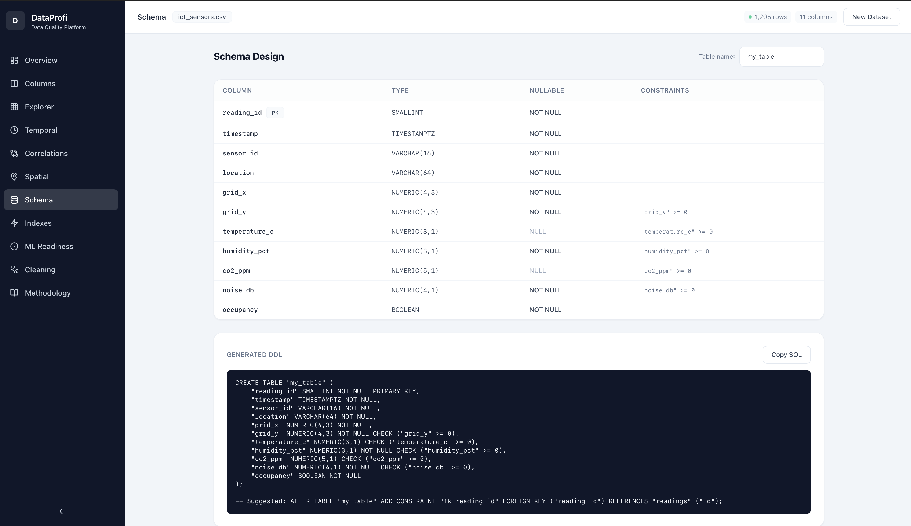
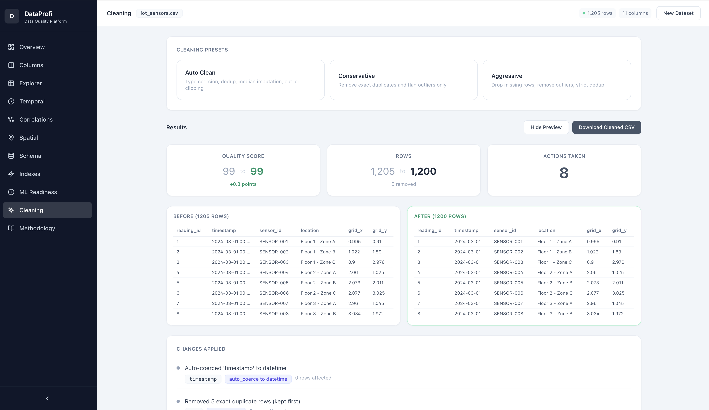

# DataProfi

**Understand your data before you train your model.**

DataProfi is a data quality profiling and preparation tool that helps you understand, clean, and validate datasets before they enter ML/AI pipelines. No more training on garbage data, no more debugging model failures that trace back to data issues.







---

## The Problem

80% of ML/AI project time is spent on data preparation. Teams commonly:

- Train models on data with silent quality issues (duplicates, outliers, encoding errors)
- Discover data problems only after model performance degrades in production
- Lack visibility into what's actually in their data before feeding it to models
- Design database schemas by guessing column types instead of analyzing the data
- Waste weeks debugging model failures that trace back to a 5% null rate in a critical feature

## The Solution

DataProfi gives you a complete data quality report in seconds - not days. Upload any dataset and instantly see:

| What You Get | Why It Matters |
|---|---|
| **Quality Score (0-100)** | One number to decide if data is ready for ML |
| **Column Intelligence** | Auto-classifies every column (ID, Category, Measure, DateTime, Text, Boolean) |
| **Outlier Detection with Row Details** | See exactly which records are anomalous and why |
| **Time-Series Analysis** | Detect gaps, seasonality, and trends in temporal data |
| **Correlation Matrix** | Find redundant features before they bloat your model |
| **Spatial Analysis** | Validate and cluster geographic data automatically |
| **Schema DDL Generation** | Get production-ready PostgreSQL CREATE TABLE statements |
| **ML Readiness Check** | 7-point checklist: class imbalance, leakage, cardinality, size |
| **Auto Cleaning Pipeline** | One-click dedup, imputation, outlier handling, type coercion |
| **Index Recommendations** | Optimal PostgreSQL indexes with plain-English explanations |

All analysis is **deterministic and rule-based** - no AI black box. Scoring methodology is aligned with **ISO 25012** and **DAMA DMBOK** data quality frameworks.

---

## Quick Start

### Option 1: Python Library

```bash
git clone https://github.com/AndreaEr/dataprofi.git
cd dataprofi
pip install -e .
```

```python
import dataprofi as dp
import pandas as pd

df = pd.read_csv("your_data.csv")

# Get quality score
report = dp.analyze(df)
print(f"Quality: {report.overall_score}/100")
print(f"Issues: {len(report.suggested_fixes)}")

# Auto-clean
cleaned = dp.auto_clean(df)

# Check ML readiness
from dataprofi.profiler.ml_readiness import check_ml_readiness
ml = check_ml_readiness(cleaned)
print(f"ML Ready: {ml.overall_ready} ({ml.score:.0f}%)")

# Get schema DDL
from dataprofi.profiler.schema_recommender import recommend_schema
schema = recommend_schema(cleaned, table_name="my_table")
print(schema.ddl)
```

### Option 2: Web Dashboard

```bash
git clone https://github.com/AndreaEr/dataprofi.git
cd dataprofi

# Backend
python3 -m venv .venv
source .venv/bin/activate
pip install -e .
uvicorn dataprofi.api.server:app --reload

# Frontend (separate terminal)
cd frontend
npm install
npm run dev
```

Open http://localhost:5173 - upload a CSV and explore.

### Option 3: Docker

```bash
docker-compose up
```

- Dashboard: http://localhost:5173
- API docs: http://localhost:8000/docs

---

## Features in Detail

### Quality Scoring (ISO 25012 Aligned)

Five dimensions, weighted and justified:

| Dimension | Weight | What It Measures |
|---|---|---|
| Completeness | 25% | Null/missing value ratio across all columns |
| Consistency | 20% | Format uniformity (mixed case, whitespace, mixed types) |
| Uniqueness | 20% | Duplicate rows and low-cardinality detection |
| Validity | 20% | Impossible values, infinities, suspicious zeros |
| Timeliness | 15% | Temporal gaps and regularity in date columns |

Each score comes with a **justification** explaining why and **estimated impact** of fixing each issue.

### Column Role Classification

DataProfi auto-detects what each column represents:

- **ID** - unique identifiers (sequential numbers, UUIDs)
- **Category** - low-cardinality labels (department, status, country)
- **Measure** - continuous numeric values (salary, price, temperature)
- **DateTime** - temporal data (timestamps, dates)
- **Free Text** - long-form text (descriptions, comments)
- **Boolean** - binary flags (yes/no, true/false, 0/1)

This drives role-aware scoring: 5% nulls in an ID column is critical; in a text column it's acceptable.

### Outlier Detection with Reason

Unlike tools that just say "3 outliers detected", DataProfi explains WHY each value is an outlier:

```
Column: salary (employee_hr.csv)
Normal range: 30,000 to 130,000 (mean: 79,013)

Row 5:  450,000
  Value 450,000 is above the normal range (30,000 to 130,000).
  It is 370,987 away from the mean (79,013).

Row 12: 5,500
  Value 5,500 is below the normal range (30,000 to 130,000).
  It is 73,513 away from the mean (79,013).
```

### Schema Design (DDL Generation)

Upload a CSV, get a production-ready PostgreSQL schema with constraints, types, and relationship hints:

```sql
CREATE TABLE "iot_sensors" (
    "reading_id" SMALLINT NOT NULL PRIMARY KEY,
    "timestamp" TIMESTAMPTZ NOT NULL,
    "sensor_id" VARCHAR(16) NOT NULL,
    "location" VARCHAR(64) NOT NULL,
    "grid_x" NUMERIC(4,3) NOT NULL,
    "grid_y" NUMERIC(4,3) NOT NULL CHECK ("grid_y" >= 0),
    "temperature_c" NUMERIC(3,1) CHECK ("temperature_c" >= 0),
    "humidity_pct" NUMERIC(3,1) NOT NULL CHECK ("humidity_pct" >= 0),
    "co2_ppm" NUMERIC(5,1) CHECK ("co2_ppm" >= 0),
    "noise_db" NUMERIC(4,1) NOT NULL CHECK ("noise_db" >= 0),
    "occupancy" BOOLEAN NOT NULL
);
```

Features:
- Auto-generates `SERIAL PRIMARY KEY` when no natural ID exists
- Maps pandas dtypes to optimal PostgreSQL types (SMALLINT, NUMERIC(p,s), TIMESTAMPTZ, etc.)
- Detects foreign key relationships by column naming patterns
- Suggests normalisation for low-cardinality repeated values



### Spatial/GIS Analysis

Auto-detects latitude/longitude columns and explains spatial issues in plain language:

```
Column pair: grid_y / grid_x (iot_sensors.csv)
Total points: 1205 | Centroid: (1.90, 1.90)

Clusters:
  Cluster 1 - 362 points within ~71.7 km radius
  Cluster 2 - 300 points within ~91.4 km radius
  Cluster 3 - 242 points within ~78.9 km radius
  Cluster 4 - 181 points within ~75.9 km radius
  Cluster 5 - 120 points within ~56.0 km radius
```

### Cleaning with Before/After Preview

Run cleaning presets and see exactly what changed:
- Side-by-side data preview (before vs after)
- Quality score improvement (e.g. 72 to 91)
- Download the cleaned CSV directly
- Detailed log of every action taken (which column, how many rows affected)



### Load from Any JSON API

No file needed - paste any URL that returns JSON:

```
https://api.example.com/data.json
```

DataProfi auto-detects nested record arrays and flattens nested objects into columns.

---

## Dashboard Preview

The web dashboard provides 11 analysis views accessible via the sidebar:

| Tab | What It Shows |
|---|---|
| **Overview** | Quality score radar chart, dimension breakdown, suggested fixes |
| **Columns** | Role-classified column list with insights, distribution charts, anomaly explanations |
| **Explorer** | Full schema table with expandable issue details per column |
| **Temporal** | Frequency detection, gap locations, trend/seasonality/stationarity |
| **Correlations** | Heatmap matrix, notable pairs with strength bars, functional dependencies |
| **Spatial** | Centroid, bounding box, cluster analysis, outlier explanations with distances |
| **Schema** | Generated DDL, column type recommendations, FK hints, normalisation suggestions |
| **Indexes** | PostgreSQL index type recommendations with SQL and plain-English explanations |
| **ML Readiness** | 7-point pass/fail checklist with severity levels and fix suggestions |
| **Cleaning** | Preset pipelines, before/after preview, CSV download |
| **Methodology** | Full scoring methodology with ISO 25012 alignment and formulas |

---

## Who Is This For

- **Data Engineers** - validate data before loading to warehouse
- **ML Engineers** - ensure training data quality before model training
- **Data Analysts** - understand new datasets quickly
- **Backend Developers** - generate database schemas from CSV exports
- **Anyone building with AI** - garbage in = garbage out, this prevents the garbage

---

## Sample Datasets Included

| File | Rows | Purpose |
|---|---|---|
| `samples/employee_hr.csv` | 205 | Outliers, missing values, duplicates, mixed types |
| `samples/ecommerce_orders.csv` | 305 | Time-series, correlations, rating nulls |
| `samples/iot_sensors.csv` | 1205 | IoT building sensors with grid coordinates, temporal, outlier detection |
| `samples/resale_flats.csv` | 40 | Categories, property data, date columns |

---

## Tech Stack

| Layer | Technology |
|---|---|
| Library | Python 3.11+, pandas, numpy, scikit-learn |
| API | FastAPI, Pydantic, uvicorn |
| Frontend | React 18, TypeScript, Vite, Tailwind CSS, Recharts |
| Database | PostgreSQL (optional, for index recommendations) |
| Icons | Lucide React |

---

## Development

```bash
# Install with dev dependencies
pip install -e ".[dev]"

# Run tests
pytest

# Run linter
ruff check .

# Type check frontend
cd frontend && npx tsc --noEmit
```

---

## Contributing

Contributions are welcome. See [CONTRIBUTING.md](CONTRIBUTING.md) for guidelines.

---

## License

Apache-2.0
